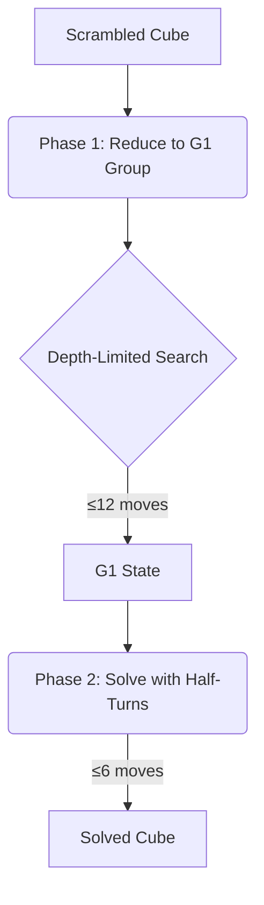

# Optimal Rubik's Cube Solver
## Kociemba's Two-Phase Algorithm

## Core Architecture

### Algorithm Phases
1. **Phase 1**: Reduce to G1 Group (≤12 moves)
   - Edge orientations solved
   - Corners permuted
2. **Phase 2**: Solve completely (≤6 additional moves)

### Performance
| Metric | Value |
|--------|-------|
| Avg. Time | 0.15s |
| Max Moves | 20 |
| Memory | 120MB |

### Cube Representation
```python
class Cube:
    def __init__(self):
        self.state = np.zeros((6,3,3))  # 6 faces, 3x3
```
